```mermaid
graph TD
    P[popup.js] --> SM[StorageManager]
    P --> AC[APIClient]
    P --> I[I18n]
    P --> TM[ThemeManager]
    P --> HM[HistoryManager]
    P --> PE[PDFExporter]
    P --> ME[MarkdownExporter]
    P --> EM[EmailManager]
    P --> TR[Translator]
    P --> CE[CitationExtractor]
    P --> PT[ProgressTracker]
    P --> EC[EventCleanup]
    P --> EH[ErrorHandler]
    P --> VC[VoiceController]
    P --> CC[ContentClassifier]
    P --> IS[InputSanitizer]
    P --> AA[AdvancedAnalysis]

    BG[background.js] --> SM
    BG --> AC
    BG --> CM[CacheManager]
    BG --> COMP[CompressionManager]
    BG --> AM[AutoMaintenance]
    BG --> CE
    BG --> IS
    BG --> EH

    RM[reading-mode.js] --> SM
    RM --> AC
    RM --> TR
    RM --> CE
    RM --> PE
    RM --> VC
    RM --> I
    RM --> IS
    RM --> AA
```

# Architecture Review - AI Article Summarizer Chrome Extension v2.2.0

**Data**: 2026-04-08
**Reviewer**: Senior Architect
**Score complessivo**: 5.5/10

---

## Executive Summary

L'estensione Chrome "AI Article Summarizer" presenta una **crescita organica non governata** che ha portato a un codebase con significativi problemi strutturali. Il progetto funziona, ma accumula debito tecnico in modo accelerato. I problemi principali sono: file God Object (popup.js a 2092 righe, api-client.js a 1912), duplicazione sistematica di codice tra le pagine, assenza totale di modularizzazione ES Modules, e un segreto crittografico hardcodato nel codice sorgente.

---

## 1. Struttura del Progetto

### Stato attuale

```
EstensioneSummarizeArticle__Chrome/
+-- manifest.json              (51 righe)
+-- background.js              (248 righe)
+-- content.js                 (319 righe)
+-- popup.js                   (2092 righe)    << CRITICO
+-- popup.html                 (345 righe)
+-- popup.css                  (1325 righe)
+-- reading-mode.js            (1989 righe)    << CRITICO
+-- reading-mode.html/css
+-- history.js                 (1837 righe)    << CRITICO
+-- history.html/css
+-- multi-analysis.js          (915 righe)     << ALTO
+-- pdf-analysis.js            (394 righe)
+-- options.js                 (296 righe)
+-- utils/                     (27 file, 12656 righe totali)
|   +-- api-client.js          (1912 righe)    << CRITICO
|   +-- translator.js          (954 righe)     << ALTO
|   +-- i18n.js                (823 righe)     << ALTO
|   +-- citation-extractor.js  (763 righe)
|   +-- i18n-extended.js       (689 righe)
|   +-- pdf-exporter.js        (629 righe)
|   +-- multi-analysis-mgr.js  (616 righe)
|   +-- ... (19 altri file)
+-- lib/                       (librerie terze parti)
+-- icons/
+-- prompts/
+-- documento_progetto/        (documentazione feature)
```

### Problemi identificati

| # | Problema | Severita |
|---|----------|----------|
| 1.1 | Tutti i file JS nella root, nessuna separazione src/pages/shared | ALTO |
| 1.2 | Nessun sistema di build (no bundler, no minification) | MEDIO |
| 1.3 | CSS duplicato tra 7 file separati senza variabili condivise | MEDIO |
| 1.4 | Nessun file di test in tutto il progetto | ALTO |
| 1.5 | `documento_progetto/` contiene 20+ file .md di feature doc ma nessun ADR | BASSO |

### Proposta di refactoring

```
src/
+-- pages/
|   +-- popup/        (popup.js, popup.html, popup.css)
|   +-- reading-mode/
|   +-- history/
|   +-- multi-analysis/
|   +-- pdf-analysis/
|   +-- options/
+-- background/
|   +-- service-worker.js
|   +-- handlers/
+-- content/
|   +-- content-script.js
+-- shared/
|   +-- api/           (api-client scomposto)
|   +-- storage/
|   +-- i18n/
|   +-- ui/            (Modal, theme, export condivisi)
|   +-- voice/
+-- lib/
```

---

## 2. Pattern Architetturali

### Stato attuale

Il progetto usa un pattern **"pagine indipendenti"**: ogni pagina HTML (popup, history, reading-mode, multi-analysis, pdf-analysis, options) carica i propri script via `<script src>` tags. Non esiste un sistema di moduli (ES Modules, AMD, o bundler). Ogni file dichiara classi globali (es. `class APIClient`, `class StorageManager`) che vengono condivise tramite scope globale.

### Problemi identificati

| # | Problema | Severita |
|---|----------|----------|
| 2.1 | **Nessun modulo system**: tutto nel global scope, rischio collisioni di nomi | CRITICO |
| 2.2 | **God Object `popup.js`**: 2092 righe, 37+ funzioni, gestisce UI + business logic + state + voice + export + email + Q&A + traduzioni + citazioni | CRITICO |
| 2.3 | **God Object `api-client.js`**: 1912 righe, 26 metodi statici, prompt per 4 provider x 6 content types + API calls + parsing + retry + completions | CRITICO |
| 2.4 | **God Object `reading-mode.js`**: 1989 righe, 41 funzioni, duplica traduzione/citazioni/Q&A dal popup | CRITICO |
| 2.5 | Pattern `importScripts()` nel service worker: non supporta tree-shaking, carica tutto sempre | MEDIO |
| 2.6 | Classi con solo metodi statici (`APIClient`, `StorageManager`, `CacheManager`) -- non sono reali classi, sono moduli namespace | BASSO |

### Proposta di refactoring

**Priorita 1**: Adottare ES Modules (`import`/`export`) per tutto il codice condiviso. Manifest V3 supporta `"type": "module"` per il service worker e gli script delle pagine dell'estensione.

**Priorita 2**: Scomporre `api-client.js` in:
- `api/providers/groq.js` - chiamata Groq
- `api/providers/openai.js` - chiamata OpenAI
- `api/providers/anthropic.js` - chiamata Anthropic
- `api/providers/gemini.js` - chiamata Gemini
- `api/prompt-builder.js` - costruzione prompt
- `api/system-prompts/` - un file per content type
- `api/response-parser.js` - parsing risposte
- `api/client.js` - orchestratore con pattern Strategy

**Priorita 3**: Estrarre da `popup.js` moduli separati:
- `popup/state-machine.js` - gestione stati UI
- `popup/export-controller.js` - export PDF/MD
- `popup/qa-controller.js` - Q&A
- `popup/translation-controller.js` - traduzioni
- `popup/citation-controller.js` - citazioni
- `popup/voice-controller-init.js` - init voice
- `popup/main.js` - orchestratore (~200 righe)

---

## 3. Dimensione File

### File che superano il limite di 300 righe

| File | Righe | Limite | Eccedenza |
|------|-------|--------|-----------|
| popup.js | 2092 | 300 | **7x** |
| reading-mode.js | 1989 | 300 | **6.6x** |
| api-client.js | 1912 | 300 | **6.4x** |
| history.js | 1837 | 300 | **6.1x** |
| multi-analysis.js | 915 | 300 | **3x** |
| translator.js | 954 | 300 | **3.2x** |
| i18n.js | 823 | 300 | **2.7x** |
| citation-extractor.js | 763 | 300 | **2.5x** |
| i18n-extended.js | 689 | 300 | **2.3x** |
| pdf-exporter.js | 629 | 300 | **2.1x** |
| multi-analysis-manager.js | 616 | 300 | **2x** |
| history-manager.js | 511 | 300 | **1.7x** |
| advanced-analysis.js | 504 | 300 | **1.7x** |
| cache-manager.js | 447 | 300 | **1.5x** |
| api-resilience.js | 410 | 300 | **1.4x** |
| compression-manager.js | 405 | 300 | **1.3x** |
| content.js | 319 | 300 | **1.06x** |
| storage-manager.js | 313 | 300 | **1.04x** |
| pdf-analyzer.js | 305 | 300 | **1.02x** |

**19 file su 33 JS superano il limite**. Il file piu grande (`popup.js`) e 7 volte il limite.

### Funzioni candidate a scomposizione (stima basata sull'analisi del codice)

Le seguenti funzioni superano significativamente le 30 righe:
- `popup.js: DOMContentLoaded handler` (~150 righe) - init monolitica
- `popup.js: showExportOptionsModal()` - costruzione DOM imperativa del modal export
- `popup.js: showMarkdownExportModal()` - costruzione DOM imperativa
- `popup.js: openEmailModal()` - costruzione DOM imperativa
- `popup.js: showVoiceSelector()` - costruzione DOM imperativa
- `api-client.js: getSystemPrompt()` - ~550 righe di prompt text per provider/type
- `api-client.js: buildPrompt()` - ~140 righe
- `api-client.js: getKeyPointsSystemPrompt()` - centinaia di righe di prompt
- `reading-mode.js: displayContent()` - rendering monolitico
- `history.js: openDetail()` - rendering dettaglio con tutti i tab

### Severita: CRITICO

---

## 4. Accoppiamento

### Stato attuale



### Problemi identificati

| # | Problema | Severita |
|---|----------|----------|
| 4.1 | `popup.js` dipende da **17 moduli** -- troppi per un singolo file, indica responsabilita eccessive | CRITICO |
| 4.2 | Accoppiamento tramite **global scope**: ogni modulo e accessibile ovunque senza dichiarazione esplicita di dipendenza | ALTO |
| 4.3 | `reading-mode.js` ri-importa e ri-implementa funzionalita identiche a `popup.js` (translate, citations, Q&A) | CRITICO |
| 4.4 | Comunicazione popup->background via `chrome.runtime.sendMessage` con stringhe action hardcodate (`'generateSummary'`, `'extractCitations'`, `'testApiKey'`) -- nessun type safety o costanti condivise | MEDIO |
| 4.5 | `StorageManager` usato come God Service: gestisce API keys, settings, lingua UI, lingua output, statistiche, cronologia -- troppe responsabilita | ALTO |

### Proposta di refactoring

1. **Introdurre un message protocol centralizzato**:
```javascript
// shared/messages.js
export const Actions = {
  GENERATE_SUMMARY: 'generateSummary',
  EXTRACT_CITATIONS: 'extractCitations',
  TEST_API_KEY: 'testApiKey'
};
```

2. **Scomporre StorageManager** in:
   - `storage/api-keys.js` - gestione chiavi API (encrypt/decrypt)
   - `storage/settings.js` - preferenze utente
   - `storage/stats.js` - statistiche uso
   - `storage/language-prefs.js` - preferenze lingua

3. **Estrarre feature condivise** (translate, citations, Q&A) in controller riutilizzabili importati sia da popup che da reading-mode.

---

## 5. Duplicazione Codice (DRY Violations)

### Duplicazioni identificate

| # | Codice duplicato | Dove | Righe stimate |
|---|-----------------|------|---------------|
| 5.1 | **Modal System** -- identico oggetto Modal{} con show/alert/confirm/success/error/warning | `popup.js`, `history.js` (righe 12-80 circa ciascuno) | ~140 righe |
| 5.2 | **Export PDF modal** -- `showExportOptionsModal()` quasi identica | `popup.js`, `history.js` | ~200 righe |
| 5.3 | **Export Markdown modal** -- `showMarkdownExportModal()` | `popup.js`, `history.js` | ~200 righe |
| 5.4 | **Traduzione articolo** -- `translateArticle()` | `popup.js`, `reading-mode.js` | ~200 righe |
| 5.5 | **Estrazione citazioni** -- `extractCitations()` | `popup.js`, `reading-mode.js` | ~100 righe |
| 5.6 | **Q&A** -- `askQuestion()` | `popup.js`, `reading-mode.js` | ~120 righe |
| 5.7 | **Theme toggle** -- `toggleTheme()` / `loadTheme()` | `popup.js`, `reading-mode.js`, `history.js` | ~60 righe |
| 5.8 | **System prompts per provider** -- prompt identici duplicati tra `gemini`, `groq`, `openai`, `anthropic` con variazioni minime | `api-client.js` (righe 86-620) | **~530 righe** |
| 5.9 | **KeyPoints system prompts** -- stessa duplicazione dei system prompts | `api-client.js` (righe 1019-1370) | **~350 righe** |
| 5.10 | **Provider call methods** -- `callGroq`, `callOpenAI`, `callAnthropic`, `callGemini` + duplicati `callGroqCompletion`, `callOpenAICompletion`, ecc. | `api-client.js` | ~300 righe |
| 5.11 | **DOM element caching** -- pattern `const elements = { ... document.getElementById() ... }` | `popup.js`, `reading-mode.js` | ~90 righe |

### Stima duplicazione totale: ~1800-2000 righe

Rappresenta circa il **10% del codebase JS totale** (20809 righe).

### Severita: CRITICO

### Proposta di refactoring

**5.8/5.9 - System prompts**: I prompt per Gemini sono dettagliati (~30 righe per content type), quelli per gli altri provider sono versioni abbreviate (~15 righe). Unificare in un singolo set di prompt parametrizzabili:

```javascript
// api/system-prompts.js
export function getSystemPrompt(contentType, detailLevel = 'full') {
  const prompts = { general: '...', scientific: '...', ... };
  return detailLevel === 'full'
    ? prompts[contentType]
    : condense(prompts[contentType]);
}
```

**5.10 - Provider calls**: Pattern Strategy:
```javascript
// api/providers/base.js
class ProviderBase {
  async call(prompt, settings) { /* template method */ }
  buildRequestBody(prompt, settings) { /* abstract */ }
  parseResponse(data) { /* abstract */ }
}
```

---

## 6. Manifest V3 Compliance

### Stato attuale

| Aspetto | Stato | Note |
|---------|-------|------|
| `manifest_version: 3` | OK | |
| Service Worker (non background page) | OK | `background.js` come service worker |
| `importScripts()` nel SW | ATTENZIONE | Funziona ma deprecato in favore di ES Modules |
| `host_permissions` separate | OK | |
| `content_security_policy` | OK | `script-src 'self' 'wasm-unsafe-eval'` |
| `web_accessible_resources` con `matches` | OK | |
| `permissions` minimali | ATTENZIONE | `<all_urls>` nel content script e troppo ampio |
| `activeTab` | OK | |
| `tts` permission | OK | |
| Action API (non browserAction) | OK | |

### Problemi identificati

| # | Problema | Severita |
|---|----------|----------|
| 6.1 | `content_scripts.matches: ["<all_urls>"]` -- il content script viene iniettato in OGNI pagina. Dovrebbe essere on-demand con `chrome.scripting.executeScript()` su richiesta dell'utente | ALTO |
| 6.2 | `importScripts()` nel service worker -- dovrebbe migrare a ES Modules (`"type": "module"` nel manifest) | MEDIO |
| 6.3 | `wasm-unsafe-eval` nel CSP -- se non usato da PDF.js, rimuovere | BASSO |
| 6.4 | Nessun `optional_permissions` -- le host permissions per le API potrebbero essere opzionali e richieste al momento della configurazione del provider | BASSO |

### Proposta di refactoring

```json
{
  "background": {
    "service_worker": "background.js",
    "type": "module"
  },
  "content_scripts": []
}
```

Usare `chrome.scripting.executeScript()` dal popup quando l'utente clicca "Analizza", evitando l'iniezione globale del content script.

---

## 7. Gestione Stato

### Stato attuale

Lo stato dell'applicazione e gestito con **variabili globali** in ogni pagina:

**popup.js**:
```javascript
let currentArticle = null;      // articolo estratto
let currentResults = null;      // riassunto + keypoints
let selectedLanguage = 'it';    // lingua output
let selectedContentType = 'auto';
let currentQA = [];             // domande e risposte
let currentTranslation;         // traduzione (implicita)
let currentCitations;           // citazioni (implicita)
```

**reading-mode.js**:
```javascript
let currentData = null;         // tutti i dati dalla storage
let syncScroll = true;
let isResizing = false;
let voiceController = null;
```

**history.js**:
```javascript
let currentHistory = [];
let currentEntry = null;
let voiceController = null;
```

### Problemi identificati

| # | Problema | Severita |
|---|----------|----------|
| 7.1 | **Nessun state management**: stato sparso in variabili globali mutabili, impossibile tracciare chi modifica cosa | ALTO |
| 7.2 | **Passaggio dati tra pagine via `chrome.storage.local`**: popup salva `readingModeData` in storage, reading-mode lo legge e lo cancella. Fragile e race-condition prone | ALTO |
| 7.3 | **Stato implicito**: `currentTranslation` e `currentCitations` non sono dichiarate esplicitamente in popup.js ma usate come globali | MEDIO |
| 7.4 | **Sincronizzazione manuale selettori**: due select per lingua (pagina iniziale e pagina ready) sincronizzati manualmente con handler duplicati | MEDIO |

### Proposta di refactoring

Introdurre un **AppState semplice** (non serve Redux per un'estensione):

```javascript
// shared/state.js
class AppState {
  constructor(defaults = {}) {
    this._state = { ...defaults };
    this._listeners = new Map();
  }

  get(key) { return this._state[key]; }

  set(key, value) {
    this._state[key] = value;
    this._notify(key, value);
  }

  onChange(key, callback) {
    if (!this._listeners.has(key)) this._listeners.set(key, []);
    this._listeners.get(key).push(callback);
  }

  _notify(key, value) {
    (this._listeners.get(key) || []).forEach(cb => cb(value));
  }
}
```

---

## 8. Comunicazione tra Componenti

### Stato attuale

```
popup.js  --sendMessage('extractArticle')--> content.js
popup.js  --sendMessage('generateSummary')--> background.js
popup.js  --sendMessage('extractCitations')--> background.js
popup.js  --sendMessage('testApiKey')--> background.js
popup.js  --chrome.storage.local.set()--> reading-mode.js
popup.js  --chrome.tabs.sendMessage('highlightParagraph')--> content.js
popup.js  --chrome.tabs.sendMessage('highlightText')--> content.js
content.js --getUrl response--> popup.js
```

### Problemi identificati

| # | Problema | Severita |
|---|----------|----------|
| 8.1 | **Solo 3 azioni nel background**: `generateSummary`, `extractCitations`, `testApiKey`. Traduzione, Q&A, advanced analysis vengono fatti DIRETTAMENTE dal popup/reading-mode caricando `api-client.js` inline. Questo rompe il pattern architetturale: il popup non dovrebbe fare chiamate API dirette | ALTO |
| 8.2 | **Nessun error boundary standardizzato** nel message passing: ogni handler ripete lo stesso try/catch + `sendResponse({ success, error })` | MEDIO |
| 8.3 | **Azioni come stringhe magic**: nessuna costante condivisa, errori di typo silenziosi | MEDIO |
| 8.4 | **Storage come message bus**: `chrome.storage.local` usato per passare dati tra popup e reading-mode. Se il popup si chiude prima che il reading-mode legga, o se due tab aprono reading-mode simultaneamente, i dati si sovrascrivono | ALTO |

### Proposta di refactoring

1. **Centralizzare tutte le chiamate API nel background**:
```javascript
// background/handlers/
// - summary-handler.js
// - citation-handler.js
// - translation-handler.js
// - qa-handler.js
// - api-test-handler.js
```

2. **Usare un message router** nel background:
```javascript
const handlers = {
  generateSummary: handleGenerateSummary,
  extractCitations: handleExtractCitations,
  translateArticle: handleTranslateArticle,
  askQuestion: handleAskQuestion,
  testApiKey: testApiKey
};

chrome.runtime.onMessage.addListener((request, sender, sendResponse) => {
  const handler = handlers[request.action];
  if (!handler) return false;

  handler(request)
    .then(result => sendResponse({ success: true, result }))
    .catch(error => sendResponse({ success: false, error: error.message }));
  return true;
});
```

3. **Passare dati via URL params** invece che storage per piccoli payload, o usare un ID unico per evitare race condition.

---

## 9. Modularita utils/

### Analisi per file

| File | Righe | Responsabilita | Verdict |
|------|-------|----------------|---------|
| api-client.js | 1912 | Prompt building + API calls per 4 provider + parsing + retry + completion | **GOD MODULE** -- da scomporre in 8+ file |
| translator.js | 954 | Traduzione articoli via API | OK se scomposto da api-client |
| i18n.js | 823 | Internazionalizzazione + dizionario traduzioni UI | ALTO -- il dizionario dovrebbe essere in file JSON separati |
| citation-extractor.js | 763 | Estrazione citazioni via AI | OK se scomposto da api-client |
| i18n-extended.js | 689 | Estensione di i18n con piu lingue | ALTO -- fusione con i18n.js o file JSON |
| pdf-exporter.js | 629 | Generazione PDF con jsPDF | OK come modulo, grande ma coeso |
| multi-analysis-manager.js | 616 | Gestione analisi multi-articolo | OK come modulo |
| history-manager.js | 511 | CRUD cronologia | OK, potrebbe essere piu snello |
| advanced-analysis.js | 504 | Analisi avanzata articoli | OK come modulo |
| cache-manager.js | 447 | Cache con TTL e invalidazione | OK come modulo |
| api-resilience.js | 410 | Retry, circuit breaker, fallback | OK come modulo, buona separazione |
| compression-manager.js | 405 | Compressione dati con LZ-string | OK come modulo |
| storage-manager.js | 313 | Encryption + settings + stats + keys | MEDIO -- troppe responsabilita |
| pdf-analyzer.js | 305 | Analisi PDF con PDF.js | OK |
| input-sanitizer.js | 295 | Sanitizzazione input | OK |
| tts-manager.js | 264 | Text-to-speech | OK |
| content-classifier.js | 238 | Classificazione tipo contenuto | Duplica `APIClient.detectContentType()` |
| markdown-exporter.js | 236 | Export in Markdown | OK |
| history-lazy-loader.js | 226 | Lazy loading lista cronologia | OK |
| auto-maintenance.js | 223 | Pulizia automatica cache/storage | OK |
| stt-manager.js | 219 | Speech-to-text | OK |
| debounce-utility.js | 210 | Debounce con queue | ALTO -- 210 righe per un debounce e eccessivo |
| progress-tracker.js | 205 | Barra progresso | OK |
| content-extractor.js | 197 | Estrazione contenuto pagina con Readability | OK |
| voice-controller.js | ~190 | Orchestratore TTS + STT | OK |
| error-handler.js | ~170 | Gestione errori centralizzata | OK |
| theme-manager.js | ~120 | Gestione tema dark/light | OK |
| event-cleanup.js | ~100 | Cleanup event listeners | OK, buona pratica |
| email-manager.js | ~150 | Composizione email | OK |
| search-optimizer.js | ~130 | Ottimizzazione ricerca testi | OK |
| pdf-cache-manager.js | ~100 | Cache specifica per PDF | Potrebbe fondersi con cache-manager |

### Duplicazione funzionale

| Funzionalita | File 1 | File 2 |
|-------------|--------|--------|
| Content type detection | `api-client.js:detectContentType()` | `content-classifier.js` (classe intera) |
| Language detection | `api-client.js:detectLanguage()` | inline in vari file |
| Cache management | `cache-manager.js` | `pdf-cache-manager.js` (sottoclasse mancata) |

### Severita complessiva: ALTO

---

## 10. Naming e Convenzioni

### Stato attuale

| Aspetto | Convenzione osservata | Coerenza |
|---------|----------------------|----------|
| File JS | kebab-case.js | Coerente |
| Classi | PascalCase | Coerente |
| Funzioni | camelCase | Coerente |
| Variabili | camelCase | Coerente |
| Costanti | UPPER_SNAKE_CASE | **Incoerente** -- `EXTENSION_SECRET` OK, ma molte costanti come camelCase |
| Commenti | Mix italiano/inglese | **Incoerente** |
| Commenti emoji | Usati come marker (`// 🆕`, `// 📚`, `// 🔄`) | **Non standard** |
| CSS classi | Mix BEM-like e flat | **Incoerente** |
| Stringhe UI hardcodate | Presenti nonostante i18n | **Incoerente** |

### Problemi identificati

| # | Problema | Severita |
|---|----------|----------|
| 10.1 | Mix italiano/inglese nei commenti e nelle stringhe (es. `'Errore generazione:'` vs `'Initialization error:'`) | MEDIO |
| 10.2 | Stringhe hardcodate in italiano nonostante il sistema i18n (es. `'Nessuna voce disponibile per questa lingua'` in popup.js riga 1978) | MEDIO |
| 10.3 | Emoji nei commenti come marker di feature (`// 🆕`) -- non cercabili, non standard | BASSO |
| 10.4 | Nessun linting configurato (no ESLint, no Prettier) | ALTO |
| 10.5 | Nessun JSDoc sistematico -- alcuni file hanno `/** */`, altri no | MEDIO |

---

## 11. Sicurezza

### Problemi identificati

| # | Problema | Severita |
|---|----------|----------|
| 11.1 | **Segreto crittografico hardcodato**: `const EXTENSION_SECRET = 'ai-summarizer-v1-secret-key-2024'` in `storage-manager.js` riga 2. Usato come master key per PBKDF2 per cifrare le API keys. Il segreto e visibile a chiunque ispezioni il codice dell'estensione | **CRITICO** |
| 11.2 | **API key Gemini nell'URL**: `callGemini()` passa la key come query parameter (`?key=${apiKey}`) -- visibile nei log, nella cronologia, nei proxy | ALTO |
| 11.3 | `content_scripts` iniettato in `<all_urls>` -- superficie di attacco inutilmente ampia | MEDIO |
| 11.4 | `message.innerHTML = voiceList` in `showVoiceSelector()` -- injection potenziale se i nomi delle voci TTS contengono HTML malevolo | MEDIO |
| 11.5 | `safetySettings: BLOCK_NONE` su tutte le categorie Gemini -- disabilita tutti i filtri di sicurezza | BASSO (decisione consapevole per summarization) |

### Proposta per 11.1

La crittografia delle API keys in `chrome.storage.local` con un segreto hardcodato offre **zero sicurezza aggiuntiva** -- e security by obscurity. Alternative:

**Opzione A** (consigliata): Rimuovere la crittografia custom. `chrome.storage.local` e gia accessibile solo all'estensione. La crittografia con segreto visibile e teatro di sicurezza.

**Opzione B**: Se si vuole protezione aggiuntiva, usare un segreto derivato dall'utente (es. PIN/password al primo avvio) come input per PBKDF2.

### Proposta per 11.2

Gemini supporta l'autenticazione via header `Authorization: Bearer` con token OAuth2. In alternativa, spostare la chiamata nel background service worker e non esporre la key nell'URL (gia il caso attuale, ma la key e comunque nell'URL della fetch).

---

## 12. Roadmap Refactoring Consigliata

### Fase 1 -- Quick Wins (1-2 giorni)

1. Estrarre il Modal System in `shared/modal.js` e importarlo da tutte le pagine
2. Estrarre costanti delle azioni message in `shared/constants.js`
3. Rimuovere la finta crittografia o documentare il trade-off
4. Aggiungere ESLint con configurazione base
5. Rimuovere `content_scripts` dal manifest, usare `chrome.scripting.executeScript()`

### Fase 2 -- Scomposizione God Objects (3-5 giorni)

1. Scomporre `api-client.js` in moduli per provider + prompt builder + response parser
2. Scomporre `popup.js` in controller per feature (export, Q&A, translation, citations)
3. Scomporre `reading-mode.js` riutilizzando i controller estratti da popup
4. Unificare `i18n.js` + `i18n-extended.js` + estrarre dizionari in JSON

### Fase 3 -- Modernizzazione (2-3 giorni)

1. Migrare a ES Modules in tutto il codebase
2. Introdurre un build step minimo (esbuild per bundling, zero-config)
3. Aggiungere un semplice state management
4. Centralizzare TUTTE le chiamate API nel background service worker
5. Struttura cartelle per dominio (pages/, shared/, background/)

### Fase 4 -- Qualita (2-3 giorni)

1. Test unitari per i moduli core (api-client, cache-manager, storage-manager)
2. Test E2E base con Playwright per i flussi principali
3. JSDoc per le interfacce pubbliche
4. Documentazione architetturale (C4 diagram)

---

## Verdetto Finale

| Area | Score | Note |
|------|-------|------|
| Struttura progetto | 4/10 | Flat, nessuna separazione |
| Pattern architetturali | 3/10 | God Objects ovunque |
| Dimensione file | 2/10 | 19/33 file sopra il limite |
| Accoppiamento | 4/10 | Global scope, dipendenze implicite |
| Duplicazione codice | 3/10 | ~2000 righe duplicate |
| Manifest V3 | 7/10 | Compliant con margini di miglioramento |
| Gestione stato | 3/10 | Variabili globali mutabili |
| Comunicazione componenti | 5/10 | Funziona ma incompleta |
| Modularita utils/ | 5/10 | Molti moduli OK, 3-4 God Modules |
| Naming/Convenzioni | 5/10 | Abbastanza coerente, manca linting |
| Sicurezza | 4/10 | Segreto hardcodato, Gemini key in URL |
| **Media** | **5.5/10** | **Funziona ma debito tecnico elevato** |

Il progetto ha una buona base funzionale -- supporta 4 provider AI, traduzione, citazioni, Q&A, export, voice, reading mode. La quantita di feature e impressionante per un progetto personale. Il problema principale e che la crescita non e stata accompagnata da refactoring strutturale, portando a God Objects e duplicazione sistematica. Il refactoring proposto in 4 fasi (~8-13 giorni) porterebbe il codebase a un livello manutenibile senza riscrittura.
